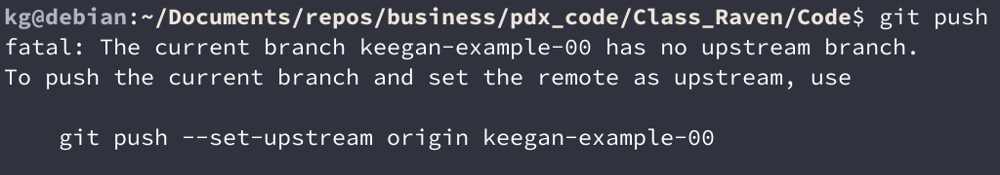
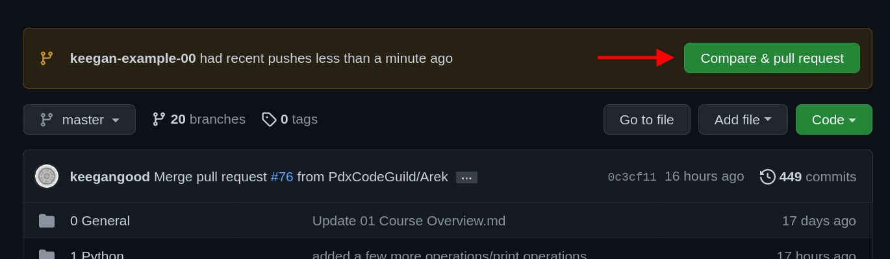
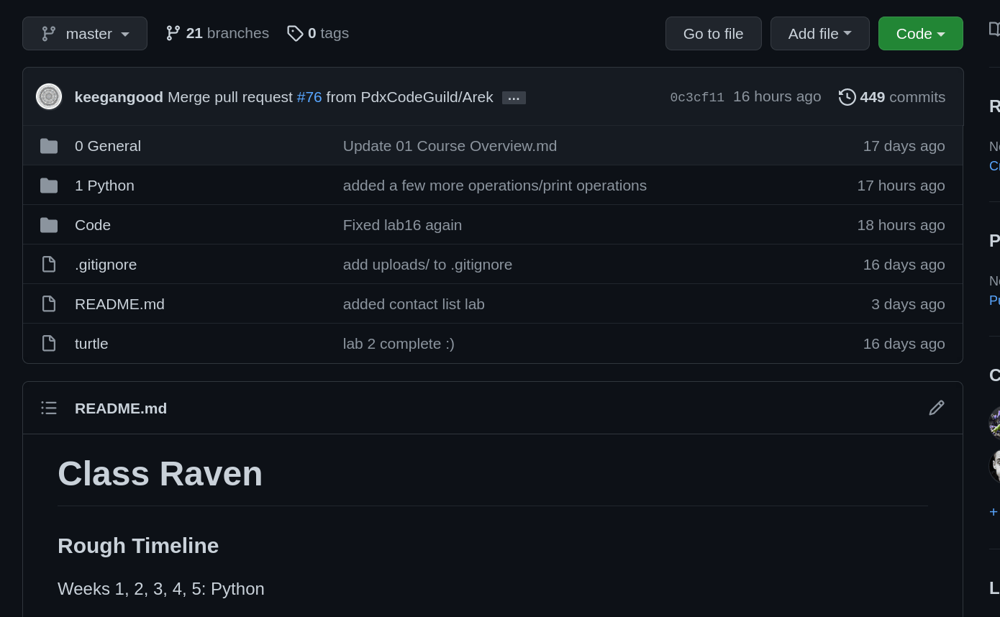
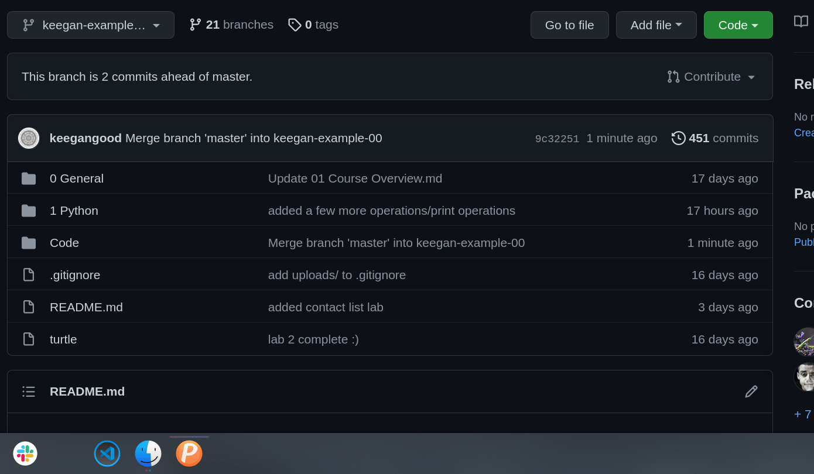
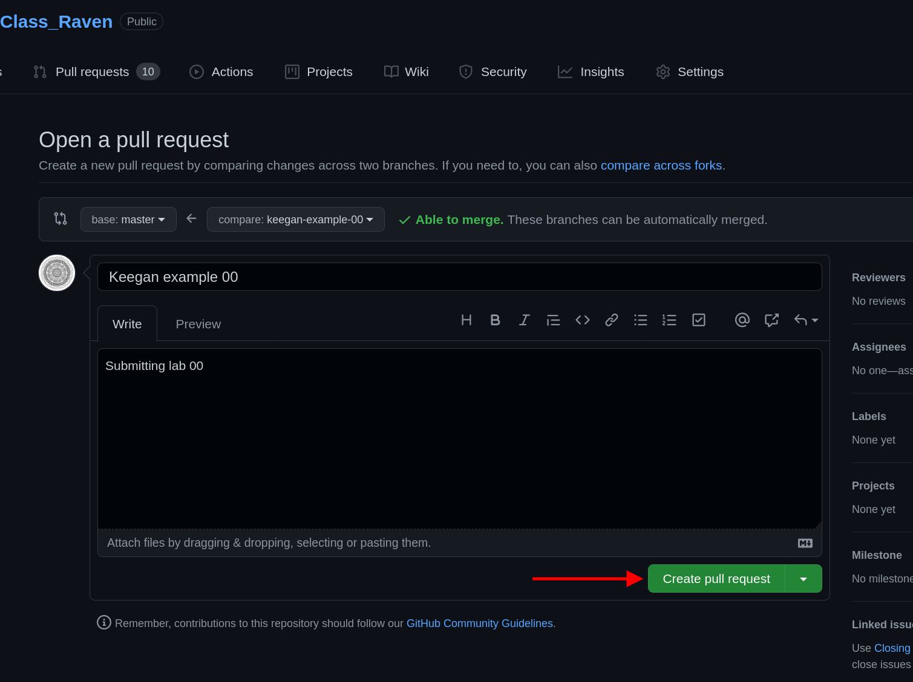

# Class Raven

### Rough Timeline

Weeks 1, 2, 3, 4, 5: Python

Weeks 6, 7, 8, 9: HTML/CSS/Flask

Weeks 10, 11: Javascript

Weeks 12, 13, 14, 15: Django

**Weeks 16, 17, 18: Capstone project**

### Scheduled Holidays (no class)
- **Nov 11** - Veterans Day
- **Nov 25 - 26** - Thanksgiving
- **Dec 23 & 24** - Christmas Eve
- **Dec 31** - New Years Eve

### Assigned Labs:

  
Python

  <ul>
    <li>Lab 02 - Make Change</li>
    <li>Lab 03 - Average Number</li>
    <li>Lab 05 - Palindrome Checker</li>
    <li>Lab 06 - Credit Card Number Validation</li>
    <li>Lab 07 - Peaks & Valleys</li>
    <li>Lab 08 - Pick 6</li>
    <li>Lab 09 - Blackjack</li>
    <li>Lab 10 - Dad Jokes</li>
    <li>Lab 11 - Rot 13</li>
    <li>Lab 13 - Count Words</li>
    <li>Lab 14 - ATM</li>
    <li>Lab 16 - Searching & Sorting</li>
    <li>Lab 17 - Contact List</li>
    <li>Lab 19 - Trivia API</li>
    <li>Lab 20 - Adventure (mob)</li>
    <li>Mini-Capstone</li>
    
Optional:

    <ul>
      <li>Stack and Linked List</li>
      <li>15 - Rain Data</li>
      <li>
      Create a Binary Search Tree
        <ul>
            <li>Add elements</li>
            <li>Search</li>
            <li>Delete elements</li>
        </ul>
      </li>
    </ul>
  </ul>

  
HTML/CSS/Flask

  <ul>
    <li>Lab 01 - Bio</li>
    <li>Lab 02 - Blog</li>
    <li>Lab 03 - Company Page</li>
    <li>Lab 04 - Personal Portfolio</li>
    <li>Lab 05 - Burrito Form</li>
    <li>Lab 06 - Flask Redo</li>
  </ul>

  
Javascript

  <ul>
    <li>Lab 01-03 - JS Redo</li>
    <li>Lab 04 - To Do List</li>
    <li>Lab 05 - Quote API</li>
  </ul>

  
Django

  <ul>
    <li>Lab 01 - To Do List</li>
    <li>Lab 02 - Blog</li>
    <li>Lab 03 - Pokedex</li>
  </ul>

### Capstone proposals due Friday, 2022-01-21

## Submitting your work

Make sure all labs are located within `Class_Raven/Code/<YourName>`

To emulate a more professional Git workflow, we're going to start creating new branches for each lab starting in the HTML/CSS section.
<h2>Creating a new branch:</h2>

Click to expand

- `git branch` to check that you're on the master branch, use `git checkout master` to go to the master branch if needed.

- `git status` to check if your local master branch is up to date with origin/master on Github.
  
- `git pull` if needed to pull any recent changes to your local repository

- Create a new branch and switch to it.
  - Option 1:
    - `git branch <YOUR_NAME-SECTION-LAB_NUMBER>`
    - `git checkout <YOUR_NAME-SECTION-LAB_NUMBER>`
  
  - Option 2:
  
    The `-b` flag can be used after the `checkout` command to combine these two steps:

    `git checkout -b <YOUR_NAME-SECTION-LAB_NUMBER>`
  
  **e.g.** My branch for the **"Lab 01 - Bio"** in the **HTML/CSS** section would be named: `keegan-htmlcss-lab01`. The name can vary a bit from this example, but please keep the chosen formatting consistent from one lab to another.

- `git add <FILENAME>` to add a specific file or `git add .` to add everything in the current dicrectory
  
- `git commit -m "your commit message"` to commit your work

- A remote branch will need to be created for each new local branch. Git will usually display the proper command to do this when a new branch is pushed for the first time.

  The command is:

  `git push --set-upstream origin <BRANCH_NAME>`

  **OR**

  `git push -u origin <BRANCH_NAME>`
  
  

    
Screenshot

    
  

- After successfully pushing your new branch to Github, you should see the option to create a Pull Request for your branch on the main repo page.

  

    
Screenshot

    
  

- If you don't see that message, you'll have to navigate to your new remote branch
  

    
Screenshot

    
  

- Once you've navigated to your individual branch, you'll find the option to create a Pull Request in the "Contribute" dropdown.
  

    
Screenshot

    
  

- Click the "Open Pull Request" button. Add a comment to your Pull Request like "Submitting Lab 00" and click "Create Pull request"
  

    
Screenshot

    
  

## Updating a branch

Click to expand

After a Pull Request is submitted, the code on that branch will be checked. Necessary corrections or adjustments will be posted as comments on the Pull Request on Github.

Corrections will be made only to that particular branch.

- `git checkout master` to switch to the master branch

- `git pull` to add the changes from the master branch into your branch.

- `git checkout <YOUR_NAME-SECTION-LAB_NUMBER>`

- `git merge master` to pull any updates from the master branch into your branch

- Add and commit updated files.

- `git push` to push your changes up to the remote repository on GitHub

- Only one Pull Request is allowed per branch. A message will be added to the current Pull Request for the new commits.

- Once a lab is complete, its branch will be merged into master.

---

## Additional Resources

  
Django

  <ul>
    <li><a href="https://github.com/perennialAutodidact/django_guides/blob/master/custom_user_model.md">Guide to Extend Django's User Model</a> - by Keegan Good</li>
    <li><a href="https://sodocumentation.net/django/topic/1235/querysets">Explanation of QuerySets</a></li>
    <li><a href="https://medium.com/shecodeafrica/understanding-the-mvc-pattern-in-django-edda05b9f43f">Understanding MVC/MTV architecture in Django</a></li>
    <li><a href="https://docs.djangoproject.com/en/4.0/topics/db/queries/#complex-lookups-with-q-objects">Complex Database Lookups with Q Objects</a></li>
    <li><a href="https://docs.djangoproject.com/en/4.0/ref/models/querysets/#select-related">select_related()</a> & <a href="https://docs.djangoproject.com/en/4.0/ref/models/querysets/#prefetch-related">prefetch_related()</a> - Solving the n+1 problem in Django</li>

  </ul>

  
SQL

  <ul>
    <li><a href="https://mystery.knightlab.com/">SQL Murder Mystery</a></li>
    <li><a href="https://sqlzoo.net/wiki/SQL_Tutorial">SQLZoo</a></li>
    <li><a href="https://www.w3schools.com/sql/">W3 Schools</a> - SQL Tutorial</li>
    <li><a href="https://learnsql.com/blog/ways-to-practice-sql-online/">SQL Practice Resources</a></li>
  </ul>

  
HTML/CSS/JS Online IDEs

  <ul>
    <li><a href="https://codepen.io">Code Pen</a></li>
    <li><a href="https://replit.com">Replit</a></li>
    <li><a href="https://codesandbox.io">Code Sandbox</a></li>
    <li><a href="https://jsfiddle.net">JS Fiddle</a></li>
  </ul>

  
Useful VS Code Extensions

  <ul>
    <li><a href="https://marketplace.visualstudio.com/items?itemName=WyattFerguson.jinja2-snippet-kit">Jinja2 Snippet Kit</a>Jinja2 snippets for cool attractive people to use in your HTML templates.</li>
    <li><a href="https://marketplace.visualstudio.com/items?itemName=CoenraadS.bracket-pair-colorizer-2">Bracket Pair Colorizer 2</a>Makes code blocks and nested expressions easier to read</li>
    <li><a href="https://marketplace.visualstudio.com/items?itemName=rangav.vscode-thunder-client">Thunder Client</a>GUI to make and manage HTTP requests</li>
    <li><a href="https://marketplace.visualstudio.com/items?itemName=yzhang.markdown-all-in-one">Markdown All-In-One</a>Quickly create markdown tables of contents and other useful markdown features</li>
    <li><a href="https://marketplace.visualstudio.com/items?itemName=xabikos.JavaScriptSnippets">Javascript ES6 Snippets</a>Useful snippets to streamline Javascript development</li>
    <li><a href="https://marketplace.visualstudio.com/items?itemName=eamodio.gitlens">GitLens</a>Compare differences between branches and easily manage remote repositories</li>
    <li><a href="https://marketplace.visualstudio.com/items?itemName=ritwickdey.LiveServer">LiveServer</a>Serve HTML/CSS/Javascript projects from VS Code</li>
  </ul>

  
SEO & Accessibility

  
<b>SEO</b>

  <ul>
    <li><a href="https://developers.google.com/search/docs/beginner/get-started?hl=en%2F">Get Started with SEO</a></li>
    <li><a href="https://moz.com/beginners-guide-to-seo">Beginner's Guide to SEO</a></li>
  </ul>
  
<b>Accessibility</b>

  <ul>
    <li><a href="https://www.w3.org/TR/html-aria/#rules-wd">ARIA in HTML - W3C</a></li>
    <li><a href="https://developer.mozilla.org/en-US/docs/Web/Accessibility/ARIA">ARIA - MDN Web Docs</a></li>
  </ul>

  
Screen Capture Tools for Creating GIFs for Project READMEs

  <ul>
    <li>
      Windows - <a href="https://www.screentogif.com">Screen to GIF</a>
    </li>
    <li>
      MacOS - <a href="https://apps.apple.com/us/app/giphy-capture-the-gif-maker/id668208984?mt=12">GIPHY</a>
    </li>
    <li>
      Linux - <a href="https://github.com/phw/peek">Peek</a>
    </li>
  </ul>

  
Webpage Styling

  
<b>Flexbox Games</b>

  <ul>
    <li><a href="https://flexboxfroggy.com/">Flexbox Froggy</a></li>
    <li><a href="https://mastery.games/flexboxzombies/">Flexbox Zombies</a></li>
  </ul>

  
<b>Color Schemes</b>

  <ul>
    <li><a href="https://coolors.co">Coolors</a></li>
    <li><a href="https://color.adobe.com/create/color-wheel">Adobe Color Wheel</a></li>
  </ul>

  
<b>Design Principles</b>

  <ul>
    <li><a href="https://www.reddit.com/r/Indiewebdev/comments/lakhft/18_tips_to_make_websites_look_better_and_a/">18 Tips to Make Websites Look Better</a></li>
    <li><a href="https://www.canva.com/learn/20-web-design-principles-follow/">20 Web Design Principles</a></li>
    <li><a href="https://blog.tubikstudio.com/anatomy-of-web-page/">Anatomy of a Webpage</a></li>
    <li><a href="https://blog.devgenius.io/what-are-html-semantic-tags-and-why-should-you-care-a0403972a217">What are Semantic HTML Tags and Why You Should Care</a></li>
    <li><a href="https://kinsta.com/blog/html-best-practices/">HTML Best Practices</a></li>
  </ul>

  

  
CSS Preprocessors

  <ul>
    <li><a href="https://youtu.be/RhX2rb10AC4">Intro to & Bootstrap Theming with Sass</a> & <a href="https://github.com/keegangood/sass_talk">Repository</a></li>
  </ul>

  
Coding Principles

  <ul>
    <li><a href="https://x-team.com/blog/principles-clean-code/">Principles of Clean Code</a></li>
  </ul>

  

